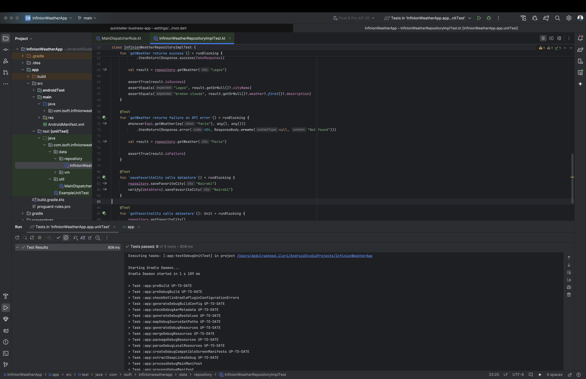

🌦️ Infinion Weather App

A simple weather application built with Android (Kotlin + Jetpack Compose) following MVVM architecture.
The app allows users to search for a city, fetch real-time weather data from the OpenWeather API
, and display temperature and weather descriptions.

Features
---------------
- Splash Screen that navigates to the home page.
- Search City: Enter the name of a city to fetch live weather data.
- Weather Info: Displays temperature and weather description.
- Details Screen: View extended weather information on a separate screen.
- Favorite City: Save your favorite city so the homepage is pre-populated with it.
- Built with Jetpack Compose for modern UI.
- MVVM Architecture with clean separation of concerns.
- Dependency Injection (Hilt).
- Unit Tests included.

Tech Stack
----------------
- Language: Kotlin
- UI: Jetpack Compose
- Architecture: MVVM
- Dependency Injection: Hilt
- Networking: Retrofit + Coroutines
- Data Storage: DataStore (for saving favorite city)
- Testing: JUnit, Mockk

Screenshots
--------------
- Splash Screen
  

- Home Screen
  

- Saved Favourite Toast
  

- Loading Screen
  

- Details Screen
  

- Unit Test Screenshot
  

Project Structure
___________________
InfinionWeatherApp/
- data/         # Data sources, Retrofit services, models
- di/           # Dependency injection modules
- repository/   # Repository layer
- ui/           # Jetpack Compose UI (screens, components)
- viewmodel/    # ViewModels for business logic
- utils/        # Utility classes/helpers

Getting Started - Prerequisites
-----------------------------------
- Android Studio Ladybug or newer
- JDK 17+
- A free API key from OpenWeather -  [OpenWeather API](https://openweathermap.org/api).

Setup
----------------------------------
- Clone the repo:
- git clone https://github.com/abulrasheedilori/infinion-weather-app.git
- Open in Android Studio.
  - Add your API key in local.properties:
    WEATHER_API_KEY=your_api_key_here

Build & Run
-------------------------------
- Minimum Requirements Checklist
- MVVM architecture
- Jetpack Compose (Android)
- SOLID principles applied
- Dependency Injection with Hilt
- Unit tests included
- Two screens (Home + Details) with view lifecycle demonstrated
- Uploaded to GitHub

👤 Author
Abdulrasheed Ilori
Linkedin: [Linkedin Profile](https://linkedin.com/in/abdulrasheedilori)